# Caper character catalog

This is the human-readable catalog of Caper's 100 account-avatar designs. It is
also a naming proposal for possible future emoji reactions: the slugs below are
**catalog labels, not a shipped reaction API**, and reactions are not implemented
by this document.

## IDs, variants, and provenance

An account stores `avatar_id = hue * 100 + design`, where `design` is 0–99 and
`hue` is 0–7. Thus the 800 persisted IDs are eight color variants of these 100
characters, not 800 different characters. Hue 0 is cataloged below; the other
variants rotate the palette in 45° steps and retain the same design and label.
Current assets are served at `/images/avatars/v3/{avatar_id}.svg`.

IDs are frozen account data. Do not reorder, reuse, or replace them; a future
collection needs a versioned schema and asset path. The original source artwork
is AI-generated companion artwork based on Caper's own mascot and
`apps/web/public/images/demo-avatars.webp`; no Puck artwork is copied or bundled.
Designs 0–3 came from that original demo sheet. Designs 4–99 came, four at a
time in reading order, from `companions-01.webp` through
`companions-24.webp`. Those 512×512 WebP source sheets are retained here for
provenance and are not served. The current v3 vectors include later hand repairs;
in particular, the rendered designs are 15 safari hat, 61 carrot cap, 64 cat,
and 69 dinosaur. There is no sombrero design in the current artwork.

`node scripts/generate-avatars.mjs` reproduces the original immutable v1 raster
atlas from the sheets (ImageMagick 7). Current vectors are exported by
`node scripts/generate-avatar-vectors.mjs`; `--check` verifies all client copies.

Website wordmarks and rotating favicons use `/images/branding/v1/{id}.svg`.
Native in-app wordmarks bundle the same transparent artwork: Rust's `BRANDING`
table, Apple's `caper-branding-{id}` assets and Android's `caper_branding_{id}`
drawables. The generator removes only the background path and circular crop;
character paths, hues and daily selections are unchanged. Profile avatars and
external window/Dock/launcher icons still use the original circular artwork.
Installed website touch/manifest icons and the iOS home-screen icon stay fixed.

## Original mascot (not an account design)

`plain-caper` is the plain Caper dot. It predates the account set and has no design ID. Keep it
separate from the 0–99 catalog: .

## Designs

Each preview is the current hue-0 v3 asset and links to the full SVG.

| Preview | Design ID | Proposed label | Description |
| --- | ---: | --- | --- |
| [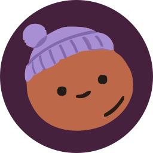](../../apps/web/public/images/avatars/v3/0.svg) | 0 | `beanie-caper` | Purple knit beanie with a pom-pom. |
|  | 1 | `headphones-caper` | Large cream over-ear headphones. |
| [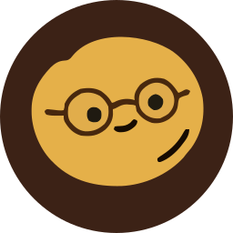](../../apps/web/public/images/avatars/v3/2.svg) | 2 | `round-glasses-caper` | Round spectacles with offset pupils. |
|  | 3 | `sleepy-star-caper` | Sleeping face with a yellow star. |
| [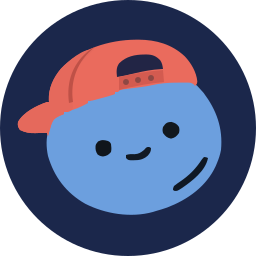](../../apps/web/public/images/avatars/v3/4.svg) | 4 | `backward-cap-caper` | Coral baseball cap worn backward. |
| [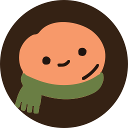](../../apps/web/public/images/avatars/v3/5.svg) | 5 | `scarf-caper` | Cozy green scarf around the base. |
|  | 6 | `astronaut-caper` | Rounded space helmet with glass visor. |
| [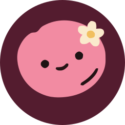](../../apps/web/public/images/avatars/v3/7.svg) | 7 | `daisy-caper` | Small cream daisy tucked at the side. |
| [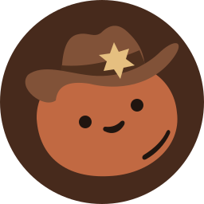](../../apps/web/public/images/avatars/v3/8.svg) | 8 | `cowboy-caper` | Brown cowboy hat with a star badge. |
|  | 9 | `crown-caper` | Gold three-point crown with a red jewel. |
| [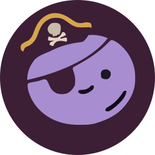](../../apps/web/public/images/avatars/v3/10.svg) | 10 | `pirate-caper` | Skull hat, eye patch, and curled smile. |
| [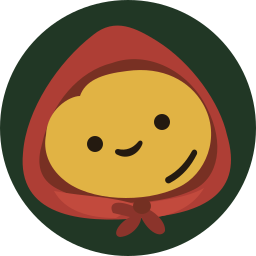](../../apps/web/public/images/avatars/v3/11.svg) | 11 | `red-hood-caper` | Red tied hood framing a yellow face. |
|  | 12 | `chef-caper` | Tall white chef's toque. |
| [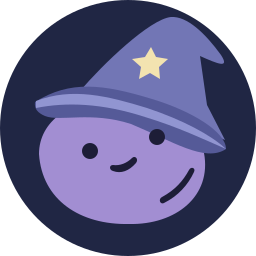](../../apps/web/public/images/avatars/v3/13.svg) | 13 | `wizard-caper` | Blue pointed hat with a gold star. |
| [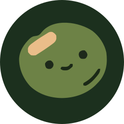](../../apps/web/public/images/avatars/v3/14.svg) | 14 | `bandage-caper` | Small adhesive bandage on the forehead. |
|  | 15 | `safari-hat-caper` | Yellow ridged safari hat with a broad brim. |
| [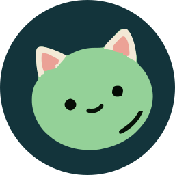](../../apps/web/public/images/avatars/v3/16.svg) | 16 | `cat-ears-caper` | Pink-lined cat ears. |
| [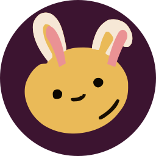](../../apps/web/public/images/avatars/v3/17.svg) | 17 | `bunny-ears-caper` | Tall cream rabbit ears with pink centers. |
| [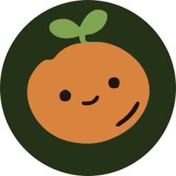](../../apps/web/public/images/avatars/v3/18.svg) | 18 | `sprout-caper` | Two-leaf green sprout on top. |
|  | 19 | `devil-caper` | Red horns and a mischievous expression. |
| [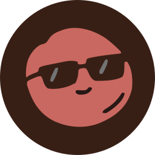](../../apps/web/public/images/avatars/v3/20.svg) | 20 | `sunglasses-caper` | Black angular sunglasses. |
|  | 21 | `halo-caper` | Slim gold halo floating overhead. |
| [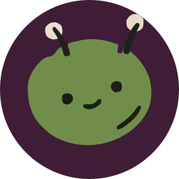](../../apps/web/public/images/avatars/v3/22.svg) | 22 | `antennae-caper` | Pair of bobble-tipped antennae. |
| [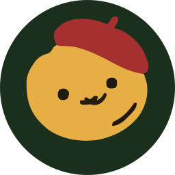](../../apps/web/public/images/avatars/v3/23.svg) | 23 | `beret-caper` | Red beret and tiny curled moustache. |
| [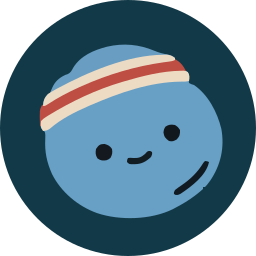](../../apps/web/public/images/avatars/v3/24.svg) | 24 | `sweatband-caper` | Striped athletic headband. |
| [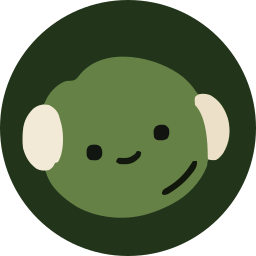](../../apps/web/public/images/avatars/v3/25.svg) | 25 | `earmuffs-caper` | Cream winter earmuffs. |
| [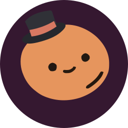](../../apps/web/public/images/avatars/v3/26.svg) | 26 | `top-hat-caper` | Small black top hat with a red band. |
|  | 27 | `sleep-mask-caper` | Cream sleep mask over closed eyes. |
| [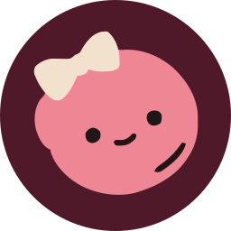](../../apps/web/public/images/avatars/v3/28.svg) | 28 | `bow-caper` | Large cream hair bow. |
| [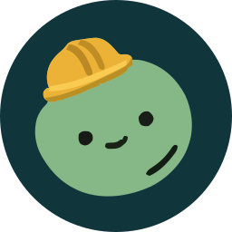](../../apps/web/public/images/avatars/v3/29.svg) | 29 | `hard-hat-caper` | Small yellow construction helmet. |
| [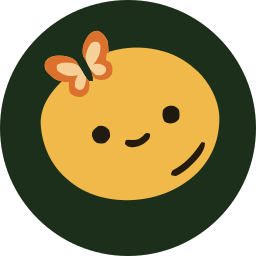](../../apps/web/public/images/avatars/v3/30.svg) | 30 | `butterfly-caper` | Orange butterfly perched overhead. |
| [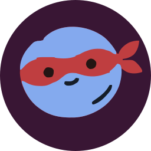](../../apps/web/public/images/avatars/v3/31.svg) | 31 | `superhero-caper` | Red tied eye mask. |
|  | 32 | `aviator-caper` | Leather flight cap and silver goggles. |
| [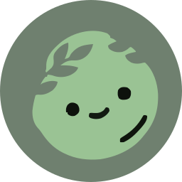](../../apps/web/public/images/avatars/v3/33.svg) | 33 | `laurel-caper` | Green laurel leaves sweeping across the brow. |
|  | 34 | `party-hat-caper` | Red-and-white striped party cone. |
| [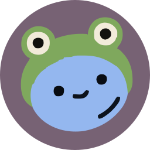](../../apps/web/public/images/avatars/v3/35.svg) | 35 | `frog-caper` | Green frog hood with raised eyes. |
| [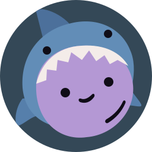](../../apps/web/public/images/avatars/v3/36.svg) | 36 | `shark-caper` | Blue shark hood with white teeth. |
| [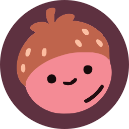](../../apps/web/public/images/avatars/v3/37.svg) | 37 | `strawberry-caper` | Red seeded strawberry cap. |
| [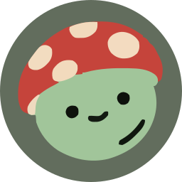](../../apps/web/public/images/avatars/v3/38.svg) | 38 | `mushroom-caper` | Red mushroom cap with cream spots. |
| [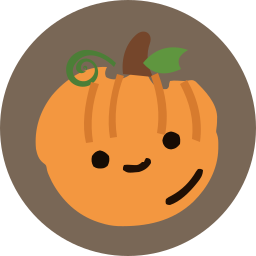](../../apps/web/public/images/avatars/v3/39.svg) | 39 | `pumpkin-caper` | Ridged orange pumpkin body and curling vine. |
| [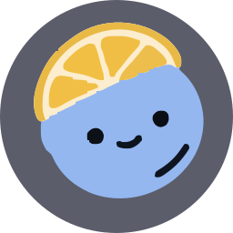](../../apps/web/public/images/avatars/v3/40.svg) | 40 | `lemon-caper` | Lemon wedge balanced on top. |
| [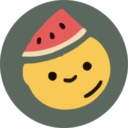](../../apps/web/public/images/avatars/v3/41.svg) | 41 | `watermelon-caper` | Watermelon slice worn as a tilted cap. |
| [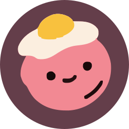](../../apps/web/public/images/avatars/v3/42.svg) | 42 | `fried-egg-caper` | Sunny-side-up egg on top. |
| [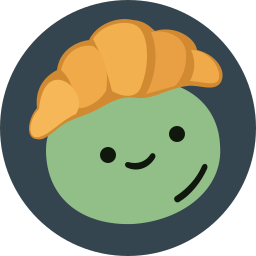](../../apps/web/public/images/avatars/v3/43.svg) | 43 | `croissant-caper` | Golden croissant curved over the head. |
| [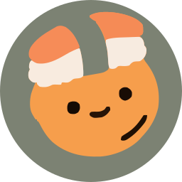](../../apps/web/public/images/avatars/v3/44.svg) | 44 | `sushi-caper` | Salmon nigiri with a dark seaweed band. |
| [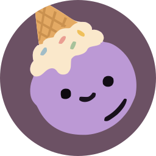](../../apps/web/public/images/avatars/v3/45.svg) | 45 | `ice-cream-caper` | Upside-down sprinkled ice-cream cone. |
| [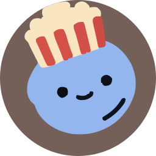](../../apps/web/public/images/avatars/v3/46.svg) | 46 | `popcorn-caper` | Striped carton overflowing with popcorn. |
|  | 47 | `teacup-caper` | White floral teacup balanced on top. |
| [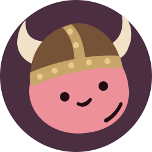](../../apps/web/public/images/avatars/v3/48.svg) | 48 | `viking-caper` | Brown riveted helmet with cream horns. |
| [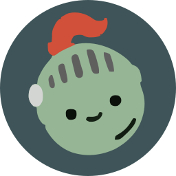](../../apps/web/public/images/avatars/v3/49.svg) | 49 | `knight-caper` | Silver barred helmet with a red plume. |
|  | 50 | `jester-caper` | Two-tone jester cap with gold bells. |
| [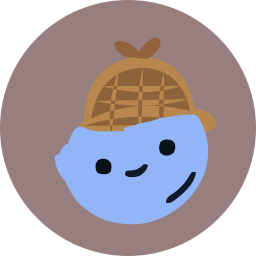](../../apps/web/public/images/avatars/v3/51.svg) | 51 | `detective-caper` | Brown checked deerstalker hat. |
| [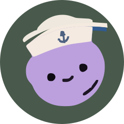](../../apps/web/public/images/avatars/v3/52.svg) | 52 | `sailor-caper` | White sailor cap with a blue anchor. |
| [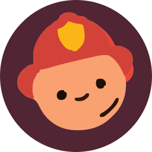](../../apps/web/public/images/avatars/v3/53.svg) | 53 | `firefighter-caper` | Red fire helmet with a gold shield. |
|  | 54 | `nurse-caper` | White nurse cap with a heart badge. |
|  | 55 | `graduate-caper` | Black mortarboard and gold tassel. |
| [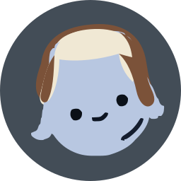](../../apps/web/public/images/avatars/v3/56.svg) | 56 | `trapper-hat-caper` | Fur-lined winter trapper hat. |
| [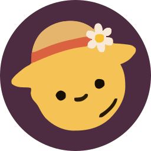](../../apps/web/public/images/avatars/v3/57.svg) | 57 | `sun-hat-caper` | Wide yellow sun hat with a daisy. |
| [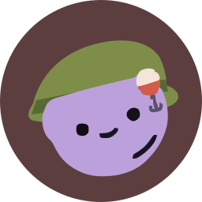](../../apps/web/public/images/avatars/v3/58.svg) | 58 | `fishing-hat-caper` | Green cap with a hooked lure. |
| [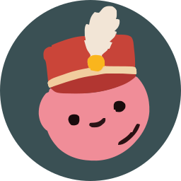](../../apps/web/public/images/avatars/v3/59.svg) | 59 | `marching-band-caper` | Red shako with a white feather plume. |
| [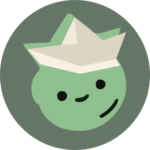](../../apps/web/public/images/avatars/v3/60.svg) | 60 | `paper-boat-caper` | Folded white paper boat hat. |
| [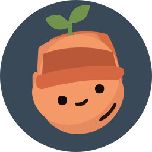](../../apps/web/public/images/avatars/v3/61.svg) | 61 | `carrot-cap-caper` | Orange carrot cap with a green sprout. |
| [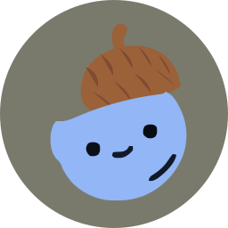](../../apps/web/public/images/avatars/v3/62.svg) | 62 | `acorn-caper` | Brown ridged acorn cap. |
| [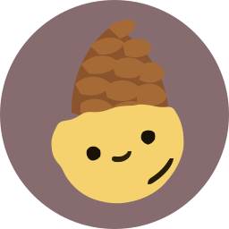](../../apps/web/public/images/avatars/v3/63.svg) | 63 | `pinecone-caper` | Layered brown pinecone cap. |
| [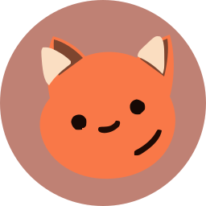](../../apps/web/public/images/avatars/v3/64.svg) | 64 | `cat-caper` | Orange cat face with cream inner ears. |
|  | 65 | `bear-caper` | Brown bear face with round ears. |
|  | 66 | `panda-caper` | Cream panda face with black ears and eye patches. |
|  | 67 | `koala-caper` | Gray koala face with fluffy ears. |
|  | 68 | `tiger-caper` | Orange tiger face with dark stripes. |
|  | 69 | `dinosaur-caper` | Green horned dinosaur with back plates. |
|  | 70 | `unicorn-caper` | Pink-and-blue mane with a striped horn. |
|  | 71 | `sheep-caper` | Fluffy cream wool and small pink ears. |
|  | 72 | `bee-caper` | Yellow-and-brown bee hood with antennae. |
|  | 73 | `ladybug-caper` | Red spotted ladybug shell and antennae. |
|  | 74 | `octopus-caper` | Purple octopus with curled tentacles. |
|  | 75 | `crab-caper` | Red crab hood with raised claws and eyes. |
|  | 76 | `penguin-caper` | Blue penguin hood with a yellow beak. |
|  | 77 | `owl-caper` | Brown owl hood with large cream eyes. |
|  | 78 | `snail-caper` | Brown spiral snail shell at the side. |
|  | 79 | `turtle-caper` | Green striped turtle shell cap. |
|  | 80 | `snorkel-caper` | Blue dive mask and yellow-tipped snorkel. |
|  | 81 | `ski-goggles-caper` | Dark ski goggles and orange knit cap. |
|  | 82 | `cyclist-caper` | Blue vented cycling helmet. |
|  | 83 | `racer-caper` | White racing helmet with red stripe. |
|  | 84 | `jeweled-turban-caper` | Cream wrapped turban with a red jewel. |
|  | 85 | `future-visor-caper` | Silver glowing futuristic visor. |
|  | 86 | `moon-cap-caper` | Purple nightcap with a gold crescent. |
|  | 87 | `rainbow-cloud-caper` | Small cloud and rainbow overhead. |
|  | 88 | `snowflake-caper` | Bright blue snowflake at the brow. |
|  | 89 | `lightning-caper` | Yellow lightning bolt at the brow. |
|  | 90 | `crystal-caper` | Cluster of blue and violet crystals. |
|  | 91 | `volcano-caper` | Small erupting brown volcano. |
|  | 92 | `cactus-caper` | Flowering green cactus garden. |
|  | 93 | `bonsai-caper` | Tiny leafy bonsai in a brown pot. |
|  | 94 | `umbrella-caper` | Colorful umbrella opened overhead. |
|  | 95 | `propeller-caper` | Red-and-white propeller beanie. |
|  | 96 | `robot-caper` | Silver robot helmet with pink antennae. |
|  | 97 | `maple-leaves-caper` | Crown of orange autumn maple leaves. |
|  | 98 | `music-notes-caper` | Pink and cream music notes overhead. |
|  | 99 | `sun-cloud-caper` | Puffy blue cloud with a peeking sun. |
