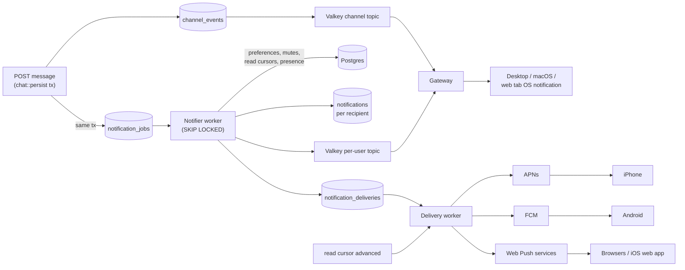

# Notifications: design and phase 1

**Status: phase 1 is built** (October 8, 2026): phone push for DMs and channel
messages over APNs and FCM, plus notification and mute controls for spaces,
channels and DMs. The server side runs behind `NOTIFICATIONS_ENABLED`, and each
platform is advertised only after its credentials are stored and it has been
validated on physical devices. [Phase 1 as built](#phase-1-as-built) is the
contract; the rest of this document is the research (October 6, 2026) and the
design for phases 2 and 3, which are not built. See also
[media.md](media.md#mobile-push-phase-1-direct-apns-and-fcm).

**Owner decisions (October 6, 2026)**

- **Content.** Notifications show the sender and a message preview, as Slack and
  Discord do. See [payload content](#payload-content).
- **Levels.** Three levels: *All messages* (the default: every channel message
  plus DMs), *Mentions & DMs*, and *Off*. Spaces, channels and DMs can also be
  turned off or muted individually.
- **Order.** Build @mentions before push, so *Mentions & DMs* is a real option
  from the start. Anyone who can post may use `@everyone` / `@here`; spam
  permissions come later.
- **Cleanup.** Drop the unused SNS-era `push_*` tables in the first push
  migration.

## Phase 1 as built

Where this section and the proposal below differ, this section is what runs.

### Who gets a notification

Per committed message (edits never notify; demo spaces and guests never do):

1. Never the author.
2. **DMs** (`direct.message`): the other participant only. Personal notes, a DM
   that is still a message request (not accepted), and a DM where either person
   blocked the other notify nobody.
3. **Space channels**: everyone who can read the channel (active members; for a
   private channel, the owner and people with a grant), minus anyone who blocked
   the author. Joining a channel is consent to hear from it, so readers who
   haven't joined, and thread replies, notify only the people they @mention.
   The kind is `mention.user` for people in `content.mentions`,
   `mention.everyone` for `@everyone` (every joined reader) or `@here` (joined
   readers whose presence is `online`), otherwise `channel.message`.
4. For each candidate, in order: account level `nothing` or `paused_until` in the
   future → none. Muted channel, DM or space → none, except `mention.user`.
   Effective level = channel override → space override → account level → `all`;
   a DM override of `nothing` silences the DM, otherwise DMs notify under `all`
   and `mentions`. `channel.message` needs `all`; `mention.*` needs `all` or
   `mentions`.
5. One `notifications` row per recipient, and one delivery per active device on
   an advertised platform whose session is still valid.

Kinds are `direct.message`, `channel.message`, `mention.user` and
`mention.everyone`. Clients treat unknown kinds as a generic message.

### Phone hold (`mobile = whenInactive`)

Gateway connection IDs are `{tag}:{uuid}`, where `tag` is the first 8 bytes of
the connection's account-session token hash in lowercase hex (`guest` without an
account). A connection is *active* while its presence lease is live and its
activity is within `PRESENCE_IDLE_TIMEOUT_SECONDS` (default 600), the same rule
that makes a person `online`. If the recipient has an active connection on a
different session than the device (an untagged ID from an older gateway counts
as different), that device's delivery is held for 60 s. When it comes due it is
dropped if the recipient is still active elsewhere. `always` never holds.

At send time every delivery also rechecks that the device and its session are
still valid, that the conversation still exists, that the message is less than
24 h old, and, for DMs, that the recipient has not read up to the message.

### Content and payloads

- Title: DM → sender display name; channels and mentions → `Sender · #channel (Space)`.
- Body: the message text, trimmed, cut to 180 characters including a final `…`;
  empty text (a forward without text) → `Sent a message`.
- APNs: `apns-push-type: alert`, `apns-priority: 10`, topic `APNS_TOPIC` (default
  `chat.caper.ios`), `apns-expiration` now + 24 h. Body
  `{"aps":{"alert":{"title","body"},"sound":"default","thread-id"},"kind","messageId","spaceId","channelId"}`;
  DMs carry `conversationId` instead of `spaceId`/`channelId`. `thread-id` is the
  conversation or channel ID.
- FCM HTTP v1, data only: `android.priority: HIGH`, `ttl: "86400s"`,
  `collapse_key` = conversation or channel ID. String data: `kind`, `messageId`,
  `conversationId` (DMs) or `spaceId` + `channelId`, `title`, `body`, `sender`,
  `senderId`, and `conversationTitle` (`#channel (Space)`, channels only).

### HTTP contract

All routes need account authentication (guests get 401), use camelCase JSON and
external IDs, and return errors as `{"error": "..."}`.

- `GET /api/push/config` → `{"platforms": [...]}`: `apns`, `apnsSandbox` and
  `fcm`, each only when notifications are enabled, it is in `PUSH_PLATFORMS` and
  its credentials load.
- `POST /api/push/devices` `{"platform","token","appId"?}` → 204. An unadvertised
  platform → 400 `push platform unavailable`; APNs tokens must be 64–200 hex
  characters (stored lowercase) and FCM tokens 1–4096 visible characters, else
  400 `invalid push token`; a non-string or invisible `appId` → 400
  `invalid app id`. One registration per sign-in session: a new address replaces
  the session's previous one, and an address held by another account or session
  is revoked there.
- `DELETE /api/push/devices` (same body; any known platform) → 204, idempotent;
  revokes only the caller's matching device. Logout revokes the session's devices.
- `GET /api/notifications/settings` →
  `{"level","mobile","overrides":[{"spaceId","level","mutedUntil"}, {"spaceId","channelId",...}, {"conversationId",...}]}`.
  Overrides whose level and mute are both unset (or the mute expired) are
  omitted, as are scopes the caller can no longer read.
- `PUT /api/notifications/settings` `{"level"?,"mobile"?}` → the full settings.
  400s: `level must be all, mentions or nothing`, `mobile must be always or
  whenInactive`, `invalid notification settings` (unknown keys).
- `PUT /api/spaces/{spaceId}/notifications`,
  `PUT /api/spaces/{spaceId}/channels/{channelId}/notifications` and
  `PUT /api/dms/{conversationId}/notifications` take `{"level"?,"mutedUntil"?}`
  and return the scope's IDs with `level` and `mutedUntil`. A missing key leaves
  the field unchanged and `null` resets it. `mutedUntil` is `"forever"` or an
  RFC 3339 time in the future and at most 365 days away, returned as whole-second
  UTC (`2026-10-08T05:00:00Z`). 400s: `level must be all, mentions, nothing or
  null`, `level must be nothing or null` (DMs), `mutedUntil must be forever or a
  time within the next year`. No read access → 404 `space not found`,
  `channel not found` or `conversation not found`.

`scripts/native-parity-fixture.mjs` serves the same routes in memory for client
tests: `POST /__fixture/control {"pushPlatforms":[...]}` sets the advertised
platforms, `GET /__fixture/push-devices` reads back registrations, and
`{"reset": true}` clears both and all settings.

### Pipeline

- `chat::persist` and the forward path insert one `notification_jobs` row in the
  send transaction. The expansion worker claims jobs with `FOR UPDATE SKIP LOCKED`
  under a 2-minute `locked_at` lease, resolves recipients, reads presence for
  `@here` and the hold, and writes `notifications` and `notification_deliveries`
  in one transaction. A job whose message is more than a day old notifies nobody.
- The delivery worker claims due deliveries the same way in one statement, calls
  the provider with no database connection held, then records the result:
  delivered; retry with exponential backoff (15 s doubling to 30 min, or the
  provider's `Retry-After` if longer) after 429, 5xx, an expired provider token or
  a network error; abandoned once the next try would be more than 24 h after the
  message, or after any other rejection; or the device revoked (APNs 410,
  `BadDeviceToken`, `DeviceTokenNotForTopic`; FCM `UNREGISTERED`,
  `SENDER_ID_MISMATCH`, or `INVALID_ARGUMENT` on the token field).
- APNs uses HTTP/2 and an ES256 JWT reused for 40 minutes; production and
  sandbox use separate keys. FCM uses an OAuth token from the service account's
  RS256 assertion, cached until 5 minutes before it expires. Signing uses
  `aws-lc-rs`, already the process's Rustls crypto provider.
- Finished deliveries and expanded jobs are pruned after 7 days. Devices are
  revoked, never deleted; settings and overrides are updated in place.
- Workers run in every API replica behind `NOTIFICATIONS_ENABLED`; they need
  `CHAT_ENABLED` (Postgres and Valkey). Bad credentials disable that platform with
  a `push_platform_unavailable` log instead of stopping the API.

### Configuration

| Setting | Meaning |
| --- | --- |
| `NOTIFICATIONS_ENABLED` | `true` starts the workers and allows platforms to be advertised. Default off. |
| `PUSH_PLATFORMS` | Comma-separated `apns`, `apnsSandbox`, `fcm`. |
| `APNS_TEAM_ID` | Apple team ID (10 characters). |
| `APNS_KEY_ID`, `APNS_PRIVATE_KEY` | Production key ID and `.p8` PEM (`apns`). |
| `APNS_SANDBOX_KEY_ID`, `APNS_SANDBOX_PRIVATE_KEY` | Sandbox key ID and `.p8` PEM (`apnsSandbox`). |
| `APNS_TOPIC` | Bundle ID; default `chat.caper.ios`. |
| `FCM_SERVICE_ACCOUNT_JSON` | The Firebase service-account JSON key, stored as one string (`fcm`). |
| `PRESENCE_IDLE_TIMEOUT_SECONDS` | Shared with the gateway; decides `online` and the hold. Default 600. |

PEM values work with real newlines or with literal `\n` escapes. All of these
are read from the API's Secrets Manager secret (`APP_SECRET_ID`) or the process
environment. They are never logged, and neither are tokens or message text.

### Validation

Covered by automated tests: the routes and their validation, enqueue inside the
send transaction (and its rollback), recipient resolution (DMs, requests, blocks,
mutes, levels, `@mention` bypassing a mute, `@everyone`, `@here`, thread
replies), the hold, delivery against mock APNs (HTTP/2) and FCM servers including
token revocation, `Retry-After`, backoff and the 24-hour cutoff, logout
revocation, and the parity fixture. Not yet validated: real APNs or FCM, and
physical Android or signed iOS devices. Keep each platform out of
`PUSH_PLATFORMS` until it has been.

### Rollout

1. Deploy the API (applies `202610080002_notifications.sql`). With
   `NOTIFICATIONS_ENABLED` unset nothing is sent, and clients see no platform.
   Older API images fail at startup against the migrated database because they
   grant access to the dropped `push_*` tables: roll forward, not back.
2. Deploy the gateway, so connection IDs carry session tags. Until then the hold
   treats every connection as another session.
3. Store the credentials (see [account setup](#account-setup-apple-and-firebase)),
   with `--platforms` listing only platforms already validated and
   `--enabled true`. No infrastructure change or deploy is needed.
4. Turning a platform off is the same command with a shorter `--platforms`;
   `--enabled false` turns all push off.

## Recommendation in one screen

- **Talk directly to Apple and Google; do not use Amazon SNS or a push vendor.**
  The integrations are three HTTPS calls (APNs, FCM HTTP v1, Web Push). SNS would
  sit in front of only two of them. Caper already has the hard parts SNS would
  otherwise provide: a durable Postgres outbox and `SKIP LOCKED` workers. See
  [Is SNS worth it?](#is-amazon-sns-worth-it).
- **One server-side pipeline with several transports.** A committed message
  enqueues one notification job in the same transaction. A worker decides who
  should be notified, using their preferences, mutes, read state and activity.
  It then fans out to:
  - a live per-user gateway feed: desktop app, macOS app and open web tabs show OS
    notifications from this feed;
  - APNs (iPhone);
  - FCM (Android);
  - Web Push (browsers, including installed iPhone web apps).
- **Preferences copied from Discord/Slack.** There are three levels: *All
  messages*, *Mentions & DMs* and *Off*. Mute can be timed. Settings cascade
  from account to space to channel or DM, so any space, channel or DM can be
  turned off.
- **Mobile first.** Phase 1 is iOS and Android push for DMs and channel messages.
  It also adds working notification and mute controls for spaces, channels and
  DMs on every client. The Android and iOS clients already contain registration,
  token and tap-handling code for DMs.
- **Provider cost is zero.** APNs, FCM and Web Push are free. SNS would add a small
  fee, but cost is not the reason to skip it.

## How push notifications work

Think of this as a primer if push is new to you.

1. **The device asks the OS vendor for an address.** The app asks the user for
   permission, then asks Apple, Google or the browser for a *push token*:
   - an APNs device token on iOS/macOS;
   - an FCM registration token on Android;
   - a push *subscription* on the web (an endpoint URL plus encryption keys).
2. **The app gives that token to our server.** The server stores it against the
   signed-in account session. That one login on that one device is a *device
   registration*.
3. **Something happens.** For example, someone sends you a DM. Our server sends
   an authenticated HTTPS request to the vendor's push service, with the token
   and a small JSON payload (about 4 KB maximum).
4. **The vendor delivers it.** Apple, Google or the browser vendor delivers it
   over the connection the OS already keeps open, so it arrives even when Caper
   is closed. The OS shows the banner. The app can run a little code first, for
   example to fill in the sender name.
5. **Tokens go stale.** Users uninstall, revoke permission or reinstall. The vendor
   answers with "unregistered" (APNs `410`, FCM `UNREGISTERED`, Web Push
   `404/410`) and we revoke that registration.

Desktop apps are different. Slack and Discord desktop are Electron apps. They
show **local** OS notifications from their own live WebSocket connection while
running, often minimized to the tray. There is no third-party push service for an
unpackaged Windows/Linux app, so Caper desktop should do the same.

## Platform matrix

| Client | Mechanism | Works when the app is closed? | Credentials we hold |
| --- | --- | --- | --- |
| iPhone/iPad app | APNs | Yes | APNs auth key (`.p8`), key ID, team ID |
| Android app | FCM HTTP v1, data messages | Yes (not after a force-stop) | Firebase project + service account (or keyless federation, see below) |
| Web: Chrome/Edge/Firefox, Safari on macOS | Web Push (service worker + VAPID) | Yes, while the browser runs | VAPID key pair we generate ourselves |
| Web on iPhone/iPad | Web Push | Only when added to the Home Screen | Same VAPID key |
| Any open web tab | Notification API driven by the gateway feed | No | None |
| macOS app (Swift) | Local notifications from the gateway feed; APNs later | No (APNs later: yes) | None (APNs later: Developer ID provisioning profile) |
| Windows/Linux desktop (egui) | Local OS notifications from the gateway feed | No; needs the app running (tray) | None |

## Is Amazon SNS worth it?

**No.** SNS "Mobile Push" is a relay. You upload your APNs key and Firebase
credentials into an SNS *platform application*. You create one SNS *platform
endpoint* per device token, then publish to the endpoint ARN. SNS forwards the
request to Apple or Google.

| What SNS would give us | Why it does not help Caper |
| --- | --- |
| The API calls AWS with its IAM workload role instead of holding Apple/Google credentials | We still create and upload the same APNs key and Firebase credentials into SNS. The Caper API already reads provider secrets from Secrets Manager (`production/apps/caper`). We can get "no provider keys in pods" without SNS: Google Workload Identity Federation for FCM, and optionally signing the APNs JWT with the `.p8` imported into AWS KMS. |
| Fan-out to topics | Chat notifications are per-user and per-device. Topic broadcast is not what we need. |
| Managed retries and delivery logs in CloudWatch | Mobile-push retries are fixed at 50 attempts over 6 hours, which delivers stale chat alerts unless every message sets a TTL. Retries are a few lines in our existing outbox/worker pattern. `Publish` returns only a message ID; provider errors appear later in CloudWatch delivery-status logs (extra setup), not in the HTTP response we act on. |
| One API for iOS and Android | **No Web Push support**, so the web still needs a direct integration. iOS VoIP/CallKit pushes for future incoming calls also need direct APNs. |

What SNS costs us:

- **A second copy of device state to keep in sync.** Every device token needs
  a matching endpoint ARN, created, updated on token rotation, and re-enabled when
  SNS disables it. This is why `push_devices.endpoint_arn` exists. It is the
  best-known pain point of SNS mobile push.
- **An extra network hop and less control.** APNs headers are reachable only
  through a fixed set of `AWS.SNS.MOBILE.APNS.*` message attributes, and newer
  provider features (for example FCM's 2026 switch from tokens to installation
  IDs) take longer to reach us.
- **Lock-in to AWS** for a feature whose real dependencies are Apple and Google.

Sources: [SNS endpoint management](https://docs.aws.amazon.com/sns/latest/dg/mobile-platform-endpoint.html),
[SNS retries](https://docs.aws.amazon.com/sns/latest/dg/sns-message-delivery-retries.html),
[SNS FCM v1 payloads](https://docs.aws.amazon.com/sns/latest/dg/sns-fcm-v1-payloads.html),
[SNS pricing](https://aws.amazon.com/sns/pricing/).

Caper has tried this before. [joswayski/caper#267](https://github.com/joswayski/caper/pull/267) removed an SNS-based push backend, and
Phase 1 uses direct APNs/FCM
([media.md](media.md#mobile-push-phase-1-direct-apns-and-fcm)).

### Other options considered

- **Firebase for everything** (FCM for iOS and web too). It adds the Firebase SDK
  to the iOS app, and FCM relays to APNs anyway. That is the same middleman
  argument as SNS, and VoIP pushes are not supported. The only gain is using one
  API instead of two. Not recommended.
- **Notification vendors** (OneSignal, Knock, Novu, Courier, Expo). They add
  dashboards, templates and analytics we don't need. They are another company
  that sees who messages whom and holds our provider keys, and some cost money
  per user. Not recommended for a single first-party app.

## What Slack and Discord do

Both products keep four ideas separate:

- **how much** notifies you;
- whether **unread** state is shown;
- **mute**;
- **which devices** get alerts.

**Discord**

- Per-server level: *All Messages*, *Only @mentions* or *Nothing*. Server admins
  set a default that applies until a member chooses their own.
- Channel and category overrides: *All*, *Mentions*, *Nothing*, *Mute*, or *Use
  default*. Resolution order is channel → category → member's server setting →
  server default.
- Timed mute: 15 min, 1 h, 3 h, 8 h, 24 h, or until turned back on. Muted channels
  hide unread dots, but direct mentions still show a red badge. *Nothing* still
  shows unread.
- Per-server toggles: suppress `@everyone`/`@here`, suppress role mentions, and
  mobile push on/off.
- DMs can only be muted.
- Mobile push is held while you are active on desktop. This is the "push
  notification inactive timeout".
- Discord stops sending push for *All Messages* in servers larger than 2,500
  members.
- Data model (community documented): `message_notifications`
  `0=ALL, 1=ONLY_MENTIONS, 2=NOTHING, 3=INHERIT`, plus `muted` and
  `mute_config {end_time}` per server and per channel override.

**Slack**

- Workspace default: *Everything* or *Mentions and DMs*.
- Per-conversation exceptions: *All new posts* or *Just mentions*, plus mute.
  Each can have different mobile settings.
- 1:1 DMs can only be muted. Muted conversations still badge on direct mentions.
- Mobile notifications wait until you are inactive on desktop. By default that
  is 1 minute after the screen locks or 10 minutes after the cursor stops moving.
- Also offers: pause notifications (DND), a notification schedule, keywords, a VIP
  list, and an "include message preview" toggle.

**Notification types both products send beyond messages:** mentions (user, role,
everyone/here), replies and followed threads, keywords, reactions (opt-in), call
ringing (CallKit on iOS), voice or stream started, invitations, scheduled events
starting, and security alerts.

Sources:
- Slack: [201355156](https://slack.com/help/articles/201355156),
  [360056534254](https://slack.com/help/articles/360056534254),
  [204411433](https://slack.com/help/articles/204411433),
  [214908388](https://slack.com/help/articles/214908388).
- Discord: [218892547](https://support.discord.com/hc/en-us/articles/218892547),
  [215253258](https://support.discord.com/hc/en-us/articles/215253258),
  [209791877](https://support.discord.com/hc/en-us/articles/209791877).
- Discord settings data model: [docs.discord.food](https://docs.discord.food/resources/user-settings).

## Notification types for Caper

Every notification has a `kind`. Kinds group into categories: user toggles,
Android notification channels and iOS thread identifiers map from the category.

| Kind | Category | When | Available |
| --- | --- | --- | --- |
| `direct.message` | Direct messages | Someone messages you 1:1 | Phase 1 |
| `channel.message` | Channel messages | New message where your level is *All* | Phase 1 |
| `space.invitation`, `channel.invitation` | Invitations | You were invited to a space or private channel | Phase 2 |
| `mention.user`, `mention.everyone` | Mentions | You are @mentioned, or `@everyone`/`@here` is used | Mentions first, then phase 1 |
| `message.reply`, `thread.reply` | Replies | Replies/threads exist (not implemented yet) | With replies |
| `message.reaction` | Reactions | Opt-in: *All / DMs only / Never* | Later |
| `call.incoming` | Calls | DM ringing; needs iOS PushKit/CallKit and an Android full-screen intent | With DM calls |
| `voice.started` | Voice | Someone starts talking in a quiet channel; rate-limited | Later |
| `account.sign_in` | Security | New sign-in; email, cannot be turned off | Later |

Clients must treat unknown kinds as a generic notification, so new kinds never
require a forced app update.

## Preferences model

### Settings and scopes

| Setting | Scopes | Values |
| --- | --- | --- |
| `level` (account) | account | `all` (default; every channel message + DMs), `mentions` (*Mentions & DMs*), `nothing` (*Off*: no notifications at all) |
| `level` (override) | space, channel | `all`, `mentions`, `nothing`, or `null` (inherit) |
| `mutedUntil` | space, channel, DM | timestamp, `forever`, or `null` |
| `pausedUntil` (DND) | account | timestamp or `null` |
| `mobile` | account | `always` or `whenInactive` (default). `whenInactive` holds phone push while you are active on desktop/web. |
| `preview` (later) | account | `full` (default), `senderOnly` or `none`. Lower settings make the server send less text (see [payload content](#payload-content)). |
| Space default level (owner setting) | space | `all` or `mentions`. Used only when a member has set nothing. |
| `suppressEveryone` (later) | space | Ignore `@everyone`/`@here` in this space |

DMs are rows in `channels`, so a DM uses the channel scope. DMs offer only on or
off plus mute, as in Slack and Discord. DMs notify under both `all` and
`mentions`; only account-level *Off* or a DM mute silences them.

### Mute versus *Off*

| | Notifications | Unread indicators |
| --- | --- | --- |
| *Off* (`nothing`) | None | Still shown |
| Muted | None | Hidden; only direct mentions still badge |

Muting a space mutes all of its channels; a channel override cannot unmute a
muted space. Mute durations: 15 min, 1 h, 8 h, 24 h, until tomorrow, or forever.

### Resolution, per recipient and event

1. The recipient can still read the conversation: space member, private-channel
   grant, or DM participant. The author is never notified.
2. Account level *Off*, or account paused (DND) → no alert. Badges and unread
   state still update.
3. Channel/DM muted, or its space muted → no alert, unless it is a direct
   @mention (which also still badges).
4. Effective level is the first non-null of:
   1. channel override;
   2. member's space setting;
   3. space owner default;
   4. account default;
   5. product default `all`. A large-space default of `mentions`, like Discord
      uses, can come later.
5. Compare the event with the level: DM → `all` or `mentions`; channel
   message → `all`; mention → `all` or `mentions`.
6. Delivery:
   - Publish the live notification to the user's gateway feed. Each client decides
     whether to show an OS notification; it does not if that conversation is
     focused.
   - Create push deliveries for each registered device. If `mobile=whenInactive`
     and the user was recently active on another client (gateway presence),
     hold mobile deliveries for about 60 s. At send time, skip them if the user
     is still active elsewhere or has read past the message.

The level is stored as a string enum. Clients must treat an unknown future value
as `mentions`.

## Architecture



### How it fits the existing server

- **Transactional enqueue.** `chat::persist` (`apps/api/src/chat.rs`) already
  writes the message, `channel_events` and `last_seq` in one transaction. Add one
  `notification_jobs` row there, keyed by message: one row per message, not per
  recipient. Expansion happens asynchronously, so large channels never slow down
  sending. Invitations get the same one-row enqueue in `spaces.rs`.
- **Replica-safe workers.** Use the same claim pattern as `publish_pending`:
  `FOR UPDATE SKIP LOCKED` plus a `locked_at` lease.
  - Claim in a short transaction, call providers outside it, then record the
    result. The pool has only 5 connections, so a provider call must never hold
    a database connection.
  - Retry with exponential backoff up to about 24 h. Abandon a delivery when its
    session is revoked or the provider reports the token as dead.
  - The removed SNS-era code ([joswayski/caper#267](https://github.com/joswayski/caper/pull/267)) had this retry design and is a usable
    reference.
- **Where the worker runs.** It starts inside the API role behind
  `NOTIFICATIONS_ENABLED`. It can move to a `--notifier` role later, like
  `--gateway`, if it needs to scale or restart independently.
- **Per-user live feed.** Today every client subscribes only to the open channel,
  so nobody hears about other conversations.
  - The worker publishes to a new Valkey topic `caper:user:v1:{user}:notifications`.
  - The gateway adds a `notifications` subscription kind. It forwards
    `notification.created`, `notification.dismissed` and `settings.updated`.
    The last one syncs mute changes across devices.
- **Presence.** Valkey already stores per-connection activity timestamps
  (`presence.rs`). The worker reads them to decide whether to hold mobile push.
- **Read state.** DMs already have `direct_reads`. Space channels have no read
  cursor today, so phase 1 holds channel pushes using presence alone. Phase 2
  adds `channel_reads` so channel unread indicators, mute's "hide unread"
  semantics, and read-sync dismissal also work for channels.
- **Logout.** `AuthVerifier::logout` revokes the session. Registrations are
  session-bound and delivery rechecks the session, so logout stops pushes
  immediately. Clients also call `DELETE /api/push/devices` as they already do.

### Proposed schema (new migration that also drops the legacy `push_*` tables)

Built as `202610080002_notifications.sql`. Differences from this sketch:
`transport` allows only `apns`, `apnsSandbox` and `fcm` and there are no Web Push
columns yet (phase 3 adds them); `app_id` defaults to `''`; `default_level` NULL
means `all`; the jobs, notifications and deliveries tables are as described in
[Pipeline](#pipeline).

```sql
-- One row per signed-in device that opted in. Raw tokens are required for direct delivery.
CREATE TABLE notification_devices (
    id bigint GENERATED ALWAYS AS IDENTITY PRIMARY KEY,
    user_id bigint NOT NULL REFERENCES users (id),
    account_session_hash bytea NOT NULL REFERENCES account_sessions (token_hash),
    transport text NOT NULL CHECK (transport IN ('apns', 'apnsSandbox', 'fcm', 'webpush')),
    app_id text NOT NULL,                 -- bundle ID / package / web origin
    address text NOT NULL,                -- APNs token, FCM token/FID, or Web Push endpoint (opaque)
    web_push_p256dh bytea, web_push_auth bytea,
    created_at timestamptz NOT NULL DEFAULT now(),
    updated_at timestamptz NOT NULL DEFAULT now(),
    revoked_at timestamptz,
    revoked_reason text
);
CREATE UNIQUE INDEX notification_devices_active_token
    ON notification_devices (transport, address) WHERE revoked_at IS NULL;

CREATE TABLE notification_settings (      -- account-level
    user_id bigint PRIMARY KEY REFERENCES users (id),
    default_level text, paused_until timestamptz,
    mobile text NOT NULL DEFAULT 'whenInactive', preview text NOT NULL DEFAULT 'full',
    updated_at timestamptz NOT NULL DEFAULT now()
);

CREATE TABLE notification_overrides (     -- space or channel/DM scope
    user_id bigint NOT NULL REFERENCES users (id),
    space_id bigint REFERENCES spaces (id),
    channel_id bigint REFERENCES channels (id),
    level text CHECK (level IN ('all', 'mentions', 'nothing')),
    muted_until timestamptz,              -- 'infinity' = forever
    updated_at timestamptz NOT NULL DEFAULT now(),
    CHECK ((space_id IS NULL) <> (channel_id IS NULL))
);
-- plus unique (user_id, space_id) and (user_id, channel_id) partial indexes

CREATE TABLE notification_jobs (...);       -- outbox: one row per message/invitation
CREATE TABLE notifications (...);           -- per recipient: kind, refs, created/dismissed; future activity inbox
CREATE TABLE notification_deliveries (...); -- per device attempt; prunable operational state
```

Data-retention rules follow `AGENTS.md`:
- Devices are revoked, not deleted.
- Settings and overrides are updated in place.
- Deliveries are short-lived and may be pruned.

New tables need runtime grants in `db::grant_runtime_access`.

**Legacy cleanup.**
- The same migration drops `push_deliveries`, `push_notifications` and
  `push_devices`. They are unused, and their data cannot be reused: they hold
  token *hashes*, while direct delivery needs raw tokens, plus ARNs for an SNS
  app that no longer exists.
- The applied `202610030002_push.sql` stays unedited.
- The same change removes their grants from `db::grant_runtime_access` and the
  tests that reference them.
- **Rollback caveat:** current API images grant access to those tables at
  startup. Once they are dropped, rolling the API back to an older image fails at
  startup, so roll forward instead.

### Proposed API (camelCase, external IDs only)

Phase 1 built the subset in [HTTP contract](#http-contract): no `webpush`,
`webPushKey` or gateway `notifications` kind yet.

**Existing routes**
- `GET /api/push/config` (already exists) → `{"platforms":["apns","apnsSandbox","fcm","webpush"],"webPushKey":"<VAPID public key>"}`.
  Already-shipped clients look only for their platform name, so this stays
  compatible.
- `POST /api/push/devices` and `DELETE /api/push/devices` take `{platform, token}`.
  This is the exact contract the dormant clients already call. The body is
  extended with optional `appId` and `webPush {endpoint, p256dh, auth}`.

**New routes**
- `GET /api/notifications/settings` → account settings plus every override, so
  clients can render mute state.
- `PUT /api/notifications/settings` updates account-level settings.
- `PUT /api/spaces/{space}/notifications`, `PUT /api/spaces/{space}/channels/{channel}/notifications`
  and `PUT /api/dms/{conversation}/notifications` take `{level?, mutedUntil?}`.
  `null` resets to inherit.

**New gateway kind**
- Subscription kind `notifications`. Events: `notification.created`,
  `notification.dismissed`, `settings.updated`.

## Platform details

### iOS (APNs)

- **Sending.** HTTP/2 `POST https://api.push.apple.com/3/device/<token>`; debug
  builds use `api.sandbox.push.apple.com`, which is `apnsSandbox`.
  - Authenticate with an ES256 JWT signed with the `.p8` key: header `kid`,
    claims `iss` = team ID and `iat`. Reuse it for 20–60 minutes; refreshing more
    often is rejected.
  - New team keys are restricted to **either** Sandbox **or** Production (at most
    two per environment). Apple recommends separate keys: production for
    TestFlight/App Store builds, sandbox for Xcode debug builds and staging.
    [Apple docs](https://developer.apple.com/documentation/usernotifications/establishing-a-token-based-connection-to-apns).
  - Headers: `apns-topic: chat.caper.ios`, `apns-push-type: alert`,
    `apns-priority: 10`, `apns-collapse-id` (per conversation),
    `apns-expiration`.
  - `410 Unregistered` → revoke the device unless it re-registered after the
    returned timestamp. `400 BadDeviceToken` usually means a sandbox/production
    mix-up. Retry only `429` and `5xx`.
- **Server dependency.** The server's `reqwest` currently has HTTP/2 disabled,
  so the `http2` feature is needed. Alternatively use `apns-h2`, Threema's
  maintained fork of the stale `a2` crate. Hand-rolling (reqwest plus a JWT
  cached for about 40 minutes) is also small.
- **Alert content.** The alert carries the title, body and conversation ID
  directly (see [payload content](#payload-content)). `thread-id` groups
  notifications by conversation. No extension is needed for phase 1.
- **Optional later: a Notification Service Extension.** With
  `mutable-content: 1`, iOS runs it for up to about 30 s before showing the
  banner.
  - It enables Communication Notifications (`INSendMessageIntent`), which show
    the sender's Caper avatar like iMessage does.
  - It needs an app group or shared keychain group with the main app; neither
    exists today.
- **Remaining iOS work.**
  - The App ID's Push Notifications capability is already implied: release
    entitlements already set `aps-environment=production`.
  - **Dismiss on read elsewhere.** Silent background pushes are throttled (Apple
    says two or three per hour) and dropped after a force-quit, so they are not
    reliable. Use the Notification Filtering entitlement instead
    (`com.apple.developer.usernotifications.filtering`, which **needs Apple
    approval**) so the extension can drop or replace notifications, and clean
    up again when the app opens.
  - Badge = unread DMs (+ mentions later), computed server-side and sent as
    `aps.badge`.
- **Incoming calls (future).** Needs PushKit VoIP pushes, which must report to
  CallKit immediately. That is a separate APNs push type and a direct-APNs
  feature.

### Android (FCM HTTP v1)

- **Sending.** `POST https://fcm.googleapis.com/v1/projects/<project>/messages:send`
  with an OAuth2 token for scope `https://www.googleapis.com/auth/firebase.messaging`.
  - Send **data-only** messages with `android.priority: HIGH`, a TTL and a
    per-conversation `collapse_key`. The data carries the conversation ID,
    message ID, title and preview text.
  - The app builds the notification itself, using `MessagingStyle` grouped per
    conversation. `CaperMessagingService` already does this for DMs, but shows
    fixed text today.
  - `UNREGISTERED`/`404` (or `INVALID_ARGUMENT` for the token) → revoke the
    device. On `429`/`503`, back off and honour `Retry-After`.
  - A high-priority data message must always end in a visible notification.
    Otherwise FCM downgrades the app's priority. "Read elsewhere, dismiss here"
    updates are therefore sent at normal priority and cancel by notification
    tag.
  - **2026 change:** Firebase is replacing registration tokens with Firebase
    Installation IDs (FIDs). Admin SDKs deprecated `token` in favour of `fid`
    in mid-2026, and `getToken()` is deprecated on Android. Store the address as
    an opaque string with a type, and have the Android client adopt FIDs when this
    ships.
  - No maintained FCM crate stands out. Hand-roll one JSON POST, with
    `google-cloud-auth` or `gcp_auth` for the OAuth token.
- **Credentials.** Phase 1 uses a service-account JSON key in Secrets Manager.
  Later hardening: the cluster already runs an OIDC issuer for AWS workload
  identity, and Google Cloud Workload Identity Federation can trust that same
  issuer. The API pod could then get FCM tokens with **no long-lived Google
  key**. Verify that end to end with FCM before relying on it.
- **Client work.**
  - CI must write `google-services.json`. Builds currently compile Firebase but
    disable it without that file.
  - Add notification channels per category: Direct messages, Channel messages,
    Mentions, Invitations, Calls.
  - Keep the Android 13+ `POST_NOTIFICATIONS` prompt behind an explicit
    "Enable notifications" action, as today.

### Web (Web Push + in-tab)

- **In-tab notifications (cheap, phase 2).** While any Caper tab is open, the
  gateway `notifications` feed drives `new Notification(...)` when the page is
  hidden or a different conversation is open. Also show an unread count in
  `document.title`. Coordinate any favicon dot with `RotatingFavicon`.
- **Web Push (phase 3).**
  - Add a service worker that receives pushes, shows the notification and focuses
    or opens `/spaces?dm=…` or `?space=…&channel=…` on click.
  - Subscribe with `pushManager.subscribe({userVisibleOnly: true, applicationServerKey})`
    and register the subscription with the API.
  - The server signs a VAPID JWT and encrypts the payload with RFC 8291
    (`aes128gcm`). `web-push-native` builds the request for our existing reqwest
    client. Web Push payloads are end-to-end encrypted to the browser, so
    including a preview is safe there.
  - Every push must show a notification; Safari revokes permission otherwise.
    Safari 18.4+ also supports Declarative Web Push, which needs no service
    worker. That is an optional later improvement.
- **iPhone/iPad.** Web Push works only for a Home Screen web app.
  - `site.webmanifest` currently uses `"display": "browser"`; it must become
    `standalone` with a proper app name and icons.
  - Permission must be requested from a user tap.

### macOS app

The macOS app is Developer ID-signed with no provisioning profile. Phase 2 shows
`UNUserNotificationCenter` **local** notifications from the gateway feed while the
app runs, which needs no provider. APNs for a closed macOS app would need a
Developer ID provisioning profile with the push entitlement embedded at signing.
It is not worth doing until people ask for it.

### Windows/Linux desktop (egui)

- **Notifications.** Show local OS notifications from the gateway feed using
  `notify-rust`. On Windows that means toast notifications, which need an
  **AppUserModelID** on the Start-menu shortcut; `installer.nsi` sets none today.
  On Linux it means the D-Bus notification daemon.
- **Staying in the background.** Closing the window currently quits the app.
  Notifications therefore need an optional "keep running in the tray" setting,
  or they only work while a window is open or minimized. Slack and Discord desktop
  behave this way.

Provider sources:
- Apple: [sending requests](https://developer.apple.com/documentation/usernotifications/sending-notification-requests-to-apns),
  [responses](https://developer.apple.com/documentation/usernotifications/handling-notification-responses-from-apns),
  [service extensions](https://developer.apple.com/documentation/usernotifications/modifying-content-in-newly-delivered-notifications).
- FCM: [HTTP v1](https://firebase.google.com/docs/cloud-messaging/send/v1-api),
  [error codes](https://firebase.google.com/docs/cloud-messaging/error-codes),
  [token management](https://firebase.google.com/docs/cloud-messaging/manage-tokens).
- Web Push: [RFC 8291](https://www.rfc-editor.org/rfc/rfc8291),
  [RFC 8292](https://www.rfc-editor.org/rfc/rfc8292),
  [Safari Web Push](https://developer.apple.com/documentation/usernotifications/sending-web-push-notifications-in-web-apps-and-browsers).

## Payload content

**Decided: send the sender and a preview, as Slack and Discord do.**

| Kind | Title | Body |
| --- | --- | --- |
| DM | sender display name | message text |
| Channel | `sender · #channel (Space)` | message text |
| Mention | same as channel | message text |

- Truncate the text to about 180 characters. Payloads stay well under the
  4 KB limit.
- Also include the conversation ID, message ID and kind, for tap navigation and
  grouping.
- Apple and Google can read APNs/FCM payloads in transit. Web Push payloads are
  encrypted end to end to the browser.
- A future account setting `preview: none` can replace the title and body with
  "New message" for people who prefer that. iOS also has its own *Show Previews:
  When Unlocked* setting.

Rejected alternatives, for the record:
- **Opaque IDs with the app fetching content.** This is Signal's approach. It
  needs the iOS extension to hold a session token and make a network request
  per notification.
- **Per-device encrypted previews.** This is Matrix-like. It keeps content
  from Apple and Google, but needs the extension and key management.

Either can be added later without changing the preference model.

## Phases

0. **@mentions (prerequisite, no external setup).** Built; see
   [media.md](media.md#scope-and-architecture) for the contract and validation.
   - `@username`, `@everyone` and `@here` autocomplete in the composer on all
     four clients, reusing the `:` emoji autocomplete pattern.
   - Highlighted mentions in messages, and a tint on messages that mention you.
   - The server tags any existing account named (in channels and DMs) and
     records them in the message's `content.mentions`. Phase 1 reads that list
     and notifies only tagged people who can read the conversation; it needs no
     separate mentions table.
1. **Mobile push for DMs and channels, with per-space/channel/DM controls.**
   Built; see [Phase 1 as built](#phase-1-as-built).
   - **Server:**
     - new migration;
     - device registration routes, and settings and override routes;
     - job and delivery workers;
     - APNs and FCM senders, with token invalidation;
     - session-bound delivery;
     - presence-based mobile hold while active on another client;
     - `push/config` advertising platforms behind a flag.
   - **iOS:** enable the dormant registration, title/body alerts and tap
     navigation for channels as well as DMs.
   - **Android:** `google-services.json` in CI, notification channels, and
     `MessagingStyle` notifications showing sender and text.
   - **Every client** (web, Android, Apple, desktop): *Notifications* and *Mute*
     items in the existing space and channel menus, plus a new DM row menu. These
     controls are real from day one because they govern mobile push.
   - **Validation:** on physical signed devices before advertising each platform.
2. **Desktop, macOS, web tabs, invitations and channel unread.**
   - Gateway per-user feed.
   - Local notifications on the macOS app, Windows/Linux desktop (with an
     AppUserModelID and an optional tray), and open web tabs.
   - Invitation kinds.
   - `channel_reads` and channel unread indicators. Mute then also hides unread.
3. **Web Push and polish.**
   - Service worker, VAPID, and a standalone manifest for iPhone web apps.
   - Badge counts.
   - Dismiss on read elsewhere: iOS filtering extension, Android tag
     cancellation, web `getNotifications()`.
   - DND/pause.
4. **With future features:**
   - per-space *suppress `@everyone`*;
   - replies and threads;
   - reactions;
   - DM calls (PushKit/CallKit, Android full-screen intent);
   - schedules and an email digest.

Each phase is its own PR with the deployment order `AGENTS.md` requires. Each
platform stays hidden from `GET /api/push/config` until it has been validated on
real devices.

## Account setup: Apple and Firebase

- **Keep the downloaded files** (`.p8` files and Firebase JSON) in your password
  manager. Each can only be downloaded once or must be regenerated.
- **Store them with one command.** The keys live in the AWS Secrets Manager
  secret `production/apps/caper` (`staging/apps/caper` with `--staging`).
  `scripts/store-push-credentials.sh` merges them in and keeps every other field;
  it never prints values, and `--dry-run` lists only the field names that would
  change. Don't paste the keys anywhere else.

  ```bash
  scripts/store-push-credentials.sh \
    --team-id ABCDE12345 \
    --apns-key-id KEY1234567 --apns-key ~/Downloads/AuthKey_KEY1234567.p8 \
    --apns-sandbox-key-id KEY7654321 --apns-sandbox-key ~/Downloads/AuthKey_KEY7654321.p8 \
    --fcm-service-account ~/Downloads/caper-push.json \
    --platforms apns,fcm --enabled true \
    --dry-run   # then run again without it
  ```

  Every option is optional, so a key can be added or rotated on its own. The
  `.p8` keys are stored with their real newlines and the service account as one
  compact JSON string; the API accepts PEM with real newlines or `\n` escapes.
- **How the API picks them up.** The API already receives every property of
  `production/apps/caper` as environment variables through the ExternalSecret
  `caper-api-account` (`dataFrom: extract`, refreshed every 5 minutes, used with
  `envFrom` and `optional: true` in joswayski/infrastructure
  `clusters/production/apps/caper/api-deployment.yaml`). The deployment carries
  `secret.reloader.stakater.com/auto: "true"`, so the API restarts when the secret
  changes. New values therefore take effect within about 5 minutes with no
  infrastructure PR or deploy, and turning a platform off is just editing
  `PUSH_PLATFORMS` the same way. The gateway does not use this secret and doesn't
  need to: the workers run in the API role.

### Apple (APNs)

You need the Account Holder or Admin role at
[developer.apple.com/account](https://developer.apple.com/account).

1. **Check the App ID.** In Certificates, IDs & Profiles → **Identifiers**, open
   `chat.caper.ios` and confirm **Push Notifications** is ticked. If it isn't,
   tick it and save.
2. **Create the production key.** Under **Keys**, click **+**.
   1. Name it `Caper APNs Production`.
   2. Tick **Apple Push Notification service**, then **Configure**.
   3. Set **Environment** to *Production* and **Key type** to *Team Scoped*.
   4. Continue, then **Confirm**, then **Download**.
   5. Note the 10-character **Key ID** shown on the key page.
3. **Create the sandbox key.** Repeat step 2 with the name `Caper APNs Sandbox`
   and **Environment** set to *Sandbox*. It is for Xcode builds and staging.
4. The **Team ID** is the one already used for release signing (top right of the
   developer site, or **Membership details**). Pass it to the script as
   `--team-id`, with each key's ID and `.p8` file.

These keys are separate from the App Store Connect API key that uploads
TestFlight builds. No certificate, provisioning profile or app rebuild is needed
for the keys themselves. iOS release builds already carry the push
entitlement.

### Firebase (FCM, Android)

1. **Create the project.** At [console.firebase.google.com](https://console.firebase.google.com),
   click **Create a project**, name it `Caper`, and turn off Google Analytics
   (not needed). If you prefer, you can attach the Google Cloud project that
   already holds the Google Play upload service account.
2. **Register the Android apps.** In **Project settings → General → Your apps**,
   add an Android app with package `chat.caper.android`. Add a second one for
   debug builds: `chat.caper.android.debug`. Skip the SDK steps; the app
   already includes them.
3. **Download `google-services.json`** after both apps are added, so it covers
   both. CI writes it into Android builds from the base64 GitHub secret
   `GOOGLE_SERVICES_JSON`; it is client configuration, not a server secret.
4. **Create the server credential.**
   1. In **Project settings → Service accounts → Manage service account
      permissions** (opens Google Cloud), create a service account named
      `caper-push`.
   2. Give it only the role **Firebase Cloud Messaging API Admin**.
   3. Under **Keys → Add key → JSON**, download the key, and store it with the
      script's `--fcm-service-account`.

   The default `firebase-adminsdk` key also works, but it can administer the
   whole Firebase project.
5. **Confirm the API is enabled.** **Project settings → Cloud Messaging** should
   show *Firebase Cloud Messaging API (V1): Enabled*.

A later hardening step can replace the JSON key with keyless Workload Identity
Federation (see [Android](#android-fcm-http-v1)).

### Not needed yet

- **Web Push.** Phase 3 generates its own VAPID keys.
- **Notification Filtering entitlement.** Apple must approve it; it is needed
  only for phase 3's "dismiss on read elsewhere".
- **macOS push.** Not planned yet.

**Open decisions**

- Whether the Windows/Linux desktop app should gain "keep running in the tray".
